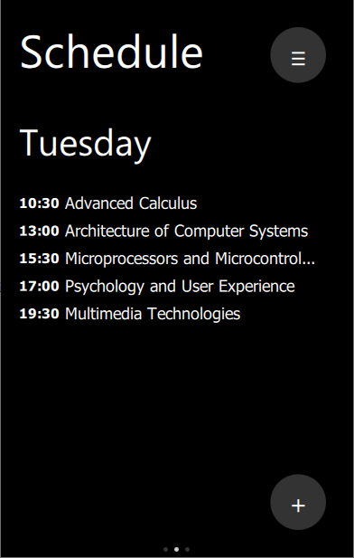

# Studies Organizer
> *Studies Organizer* is a Qt/QML Android application to track Your weekly schedule, add notes and save future events.

## Table of contents
* [General info](#general-info)
* [Screenshots](#screenshots)
* [Technologies](#technologies)
* [Setup](#setup)

## General info
Organize all of Your schedules, dates of future exams, due projects or save little details that otherwise You would have forgotten! *Studies Organizer* with its simplistic design lets You store all of that information in a fast, lightweight application, that can be useful for students at any level of education.

## Screenshots

	
	
	
	
	

## Technologies
* Qt 5.15.1 for Android
* SQLite 3.33.0
* Java OpenJDK 11
* Android SDK - API Level 30
* Android NDK ver. 21.3.6528147

## Setup
* Download [studies-organizer-android-build-release-signed.apk](https://github.com/sweakpl/studies-organizer-app/releases),
* Put it e.g. in a `Downloads` folder in Your Android device,
* Go to the `Downloads` folder on the Android device,
* Tap the file and install - the file doesn't require any special permissions.